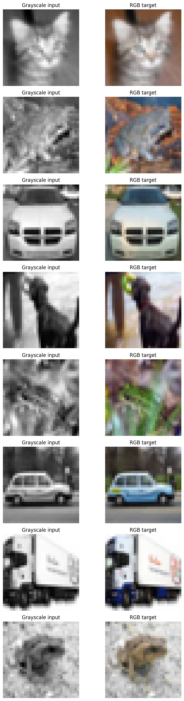
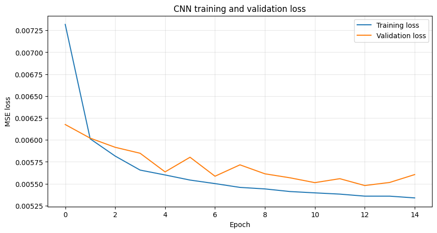
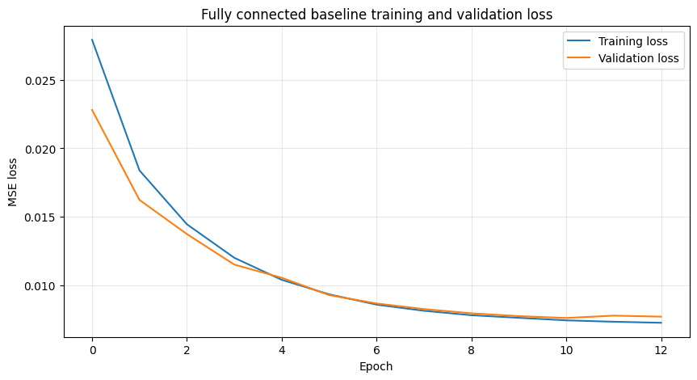
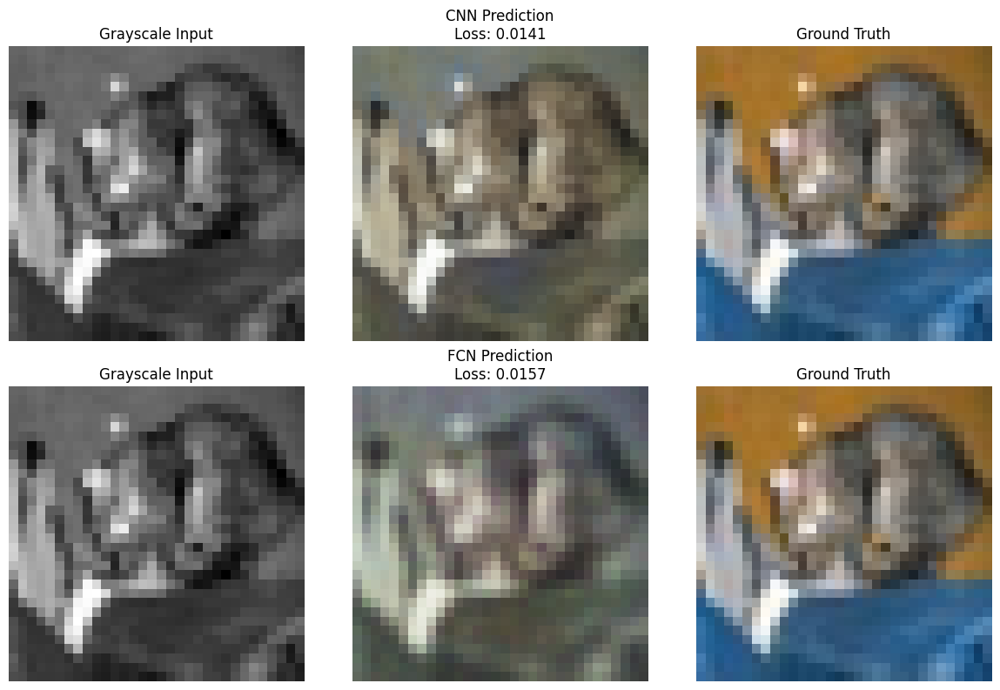
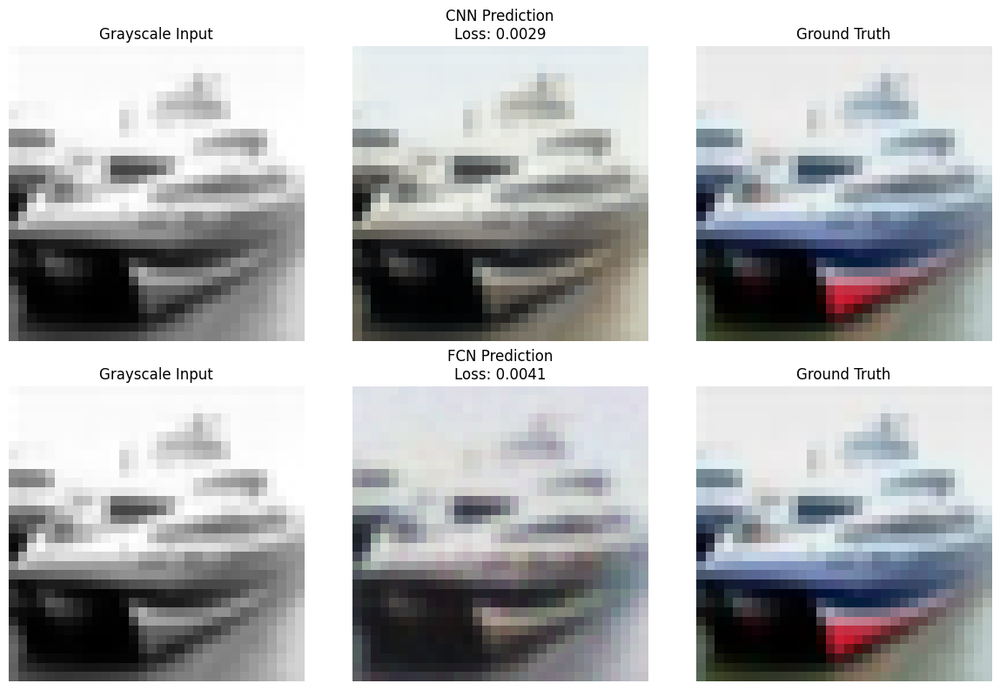
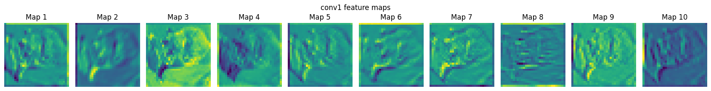
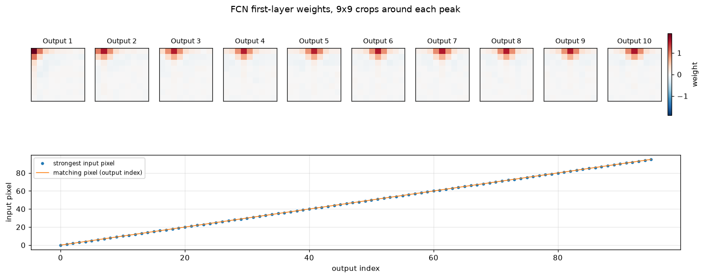

## Overview

Colorization is a supervised image-to-image problem: the model receives a
grayscale image and predicts the three colour channels that were removed.

Two PyTorch models are trained on the same task, the same loss and the same
data. One is convolutional; the other flattens the image and maps pixels
directly. The comparison is the point, because the second model has roughly 21
times more parameters and still loses.

[The notebook](https://github.com/O-2wice/cifar10-image-colorization/blob/main/notebooks/original-image-colorization.ipynb)
is the runnable artifact: it trains on a Colab GPU and writes the figures and
metrics this page reads. That split keeps the page renderable on any machine,
with no GPU, no dataset download and no checkpoints. All the code on this page
comes from it, and every figure was produced by running it.

[](https://colab.research.google.com/github/O-2wice/cifar10-image-colorization/blob/main/notebooks/original-image-colorization.ipynb)
&nbsp;
[Browse the repository](https://github.com/O-2wice/cifar10-image-colorization)

```{python}
#| label: load-artifacts
#| echo: false

import json
from pathlib import Path

METRIC_DIR = Path("outputs/metrics")
FIGURE_DIR = Path("outputs/figures")

history = json.loads((METRIC_DIR / "training_history.json").read_text())
test_results = json.loads((METRIC_DIR / "test_results.json").read_text())
```

## Why the Targets Are Not Normalized

This decision determines whether any of the numbers below mean anything.

Both models end in a `sigmoid`, which can only emit values in $[0, 1]$. The RGB
targets are therefore produced with `ToTensor()` alone, which already maps
pixels into that range, and no `Normalize()` is applied.

The coursework version this project grew out of normalized targets to
$[-1, 1]$. A sigmoid cannot reach the negative half of that range, so those
targets were unreachable by construction. The error contributed by the negative
half alone is

$$
\mathbb{E}\left[(0 - y)^2 \;\middle|\; y < 0\right] \cdot P(y < 0) \approx 0.16,
$$

which is almost exactly where the original run plateaued: `0.1476` and `0.1529`.
The models were not underfitting. They were being asked to predict values they
could not represent. After the fix, the same architectures reach around `0.005`.

## The Data

CIFAR-10 provides 60,000 32x32 colour images. The labels are unused: each image
is its own supervision signal, with a grayscale copy as input and the original
as target.

```python
class GrayscaleToColorDataset(Dataset):
    """Return (grayscale input, RGB target) pairs from an image dataset."""

    def __getitem__(self, idx):
        image, _ = self.dataset[idx]
        return self.gray_transform(image), self.color_transform(image)
```

<small>[See it in the notebook](https://github.com/O-2wice/cifar10-image-colorization/blob/main/notebooks/original-image-colorization.ipynb)</small>

Both transforms are applied to the same PIL image, which is what keeps each
input aligned with its target.

The 50,000 training images are split 45,000 / 5,000. Early stopping and
checkpoint selection read only the validation split; the 10,000 test images are
touched once, at the end.



## The Two Models

The convolutional colorizer holds full resolution throughout. There is no
pooling: a colour decision is needed at every pixel, so there is nothing to gain
from compressing to a global summary and back.

```python
class ColorizationCNN(nn.Module):
    def __init__(self):
        super().__init__()
        self.conv1 = nn.Conv2d(1, 64, kernel_size=3, padding=1)
        self.conv2 = nn.Conv2d(64, 128, kernel_size=3, padding=1)
        self.conv3 = nn.Conv2d(128, 64, kernel_size=3, padding=1)
        self.conv4 = nn.Conv2d(64, 3, kernel_size=3, padding=1)
        self.sigmoid = nn.Sigmoid()
```

The baseline flattens the image and applies a single linear map. It has no
notion of which pixels are neighbours, so it must learn every input-pixel to
output-pixel relationship separately.

```python
class ColorizationLinear(nn.Module):
    def __init__(self, image_side=32):
        super().__init__()
        self.fc1 = nn.Linear(image_side * image_side, 3 * image_side * image_side)
```

That difference is the whole experiment: 150,019 parameters against 3,148,800.

## Choosing a Loss

Predicting continuous channel values is regression, which rules out
cross-entropy. Mean squared error is used throughout:

$$
\mathcal{L}_{\text{MSE}} = \frac{1}{N} \sum_{i=1}^{N} (y_i - \hat{y}_i)^2
$$

It is cheap, differentiable everywhere, and penalises large errors
disproportionately, which pushes the model off wildly wrong colours early.

Its weakness shows up in the predictions below. Because the penalty is
quadratic, the safest guess under uncertainty is the average of the plausible
colours, so a model unsure whether a car is red or blue minimizes expected error
by predicting grey-brown. Mean absolute error grows linearly and desaturates
less; perceptual losses compare features from a pretrained network and match
human judgement far better, at the cost of a second network.

The deeper limit is that no per-pixel loss can be fully right here. Colorization
is **ill-posed**: a grey car could be red or blue, and both are correct. A
per-pixel loss scores against the one colour the original photograph happened to
have, penalising a plausible alternative as hard as a wrong one. Every number
below sits under that ceiling.

## Training

Adam at `1e-3`, batch size 64, up to 20 epochs, early stopping after two epochs
without a validation improvement.

Every epoch writes two checkpoints: the best weights so far, and a resume file
carrying optimizer state and history. Training runs on a Colab runtime that can
disconnect, and the resume file is what makes an interruption cost one epoch
instead of the whole run.

The same run is available as a terminal script,
[`scripts/train_colorization.py`](https://github.com/O-2wice/cifar10-image-colorization/blob/main/scripts/train_colorization.py),
for training without a notebook.

```{python}
#| label: epochs-table
#| echo: false
#| output: asis

cnn_epochs = len(history["cnn"]["val_loss"])
fcn_epochs = len(history["fcn"]["val_loss"])

print(f"""
Both models stopped early, so both had converged rather than run out of budget:
the CNN after {cnn_epochs} epochs, the baseline after {fcn_epochs}.
""")
```

::: {layout-ncol=2}



:::

The shapes differ in a way worth noting. The CNN drops almost to its final loss
within one epoch and then flattens. The baseline descends gradually across all
of its epochs, ending higher than where the CNN started flat.

## Results

```{python}
#| label: results-table
#| echo: false
#| output: asis

cnn_test = test_results["cnn_test_loss"]
fcn_test = test_results["fcn_test_loss"]
cnn_params, fcn_params = 150_019, 3_148_800

better = "CNN" if cnn_test < fcn_test else "baseline"
gap = abs(cnn_test - fcn_test) / max(cnn_test, fcn_test) * 100

print(f"""
| | CNN colorizer | Fully connected baseline |
|---|---|---|
| Trainable parameters | {cnn_params:,} | {fcn_params:,} |
| Epochs trained | {cnn_epochs} | {fcn_epochs} |
| Best validation MSE | {min(history['cnn']['val_loss']):.4f} | {min(history['fcn']['val_loss']):.4f} |
| Held-out test MSE | **{cnn_test:.4f}** | {fcn_test:.4f} |

The {better} reached the lower test MSE, by {gap:.0f}% relative, with
{cnn_params / fcn_params:.1%} as many parameters as the baseline.
""")
```

## Predictions





The CNN keeps object boundaries intact and applies colour in coherent regions.
The baseline produces blotchier output with colour that drifts across edges,
which follows from having no representation of adjacency.

Both are muted against the ground truth. That is the MSE hedging described
above, not undertraining, and it will not improve with more epochs.

## What the CNN Learned



Early layers respond to edges and local contrast. Later ones combine those into
the regional decisions the final layer turns into colour.

## What the Baseline Learned

A full weight row is not worth plotting: 1,023 of its 1,024 values sit near
zero, so the image is a flat field under any colormap and the single cell that
matters is a speck. Cropping around each output's strongest weight, and tracking
where that peak falls, shows the structure instead.



The peak lands on the matching pixel for **96 of 96** outputs checked, which is
the diagonal in the lower panel. Output $i$ reads input pixel $i$.

The crops add one detail the diagonal alone does not. Around each peak sits a
weaker band of *positive* weight over the immediate neighbours, so the baseline
is not quite a pure per-pixel lookup: it leans slightly on the surrounding
brightness, averaging over a small neighbourhood before choosing a colour.

That is the interesting part. Given no architectural notion of adjacency, and
3.1M free parameters with which to learn anything at all, the model spent them
rediscovering that neighbouring pixels are related — approximating, badly and
expensively, what a convolution is handed for free. It also shows nothing
resembling the edge or texture detectors a hidden layer in a deeper network
would develop, because there is no hidden layer in which they could form.

## Takeaways

The parameter counts carry the result. A $3 \times 3$ filter is applied at all
1,024 positions, so the CNN learns one set of weights and reuses it everywhere.
The baseline spends 3.1M parameters learning each input-pixel to output-pixel
relationship separately, and arrives at a worse answer. The same effect appears
three times on this page: in the parameter counts, in the test losses, and in
the single-pixel weight maps.

Colour is where both fall short, and a different objective is what would fix it,
not a different architecture.

**Next steps:**

- an encoder-decoder with skip connections, so detail survives downsampling
- prediction in Lab space, colorizing only the `ab` channels and keeping the
  given `L`, which removes the brightness half of the problem
- a perceptual or adversarial term to counteract the desaturation
- SSIM or LPIPS alongside MSE, since neither model should be judged only on the
  metric it was trained to minimize
